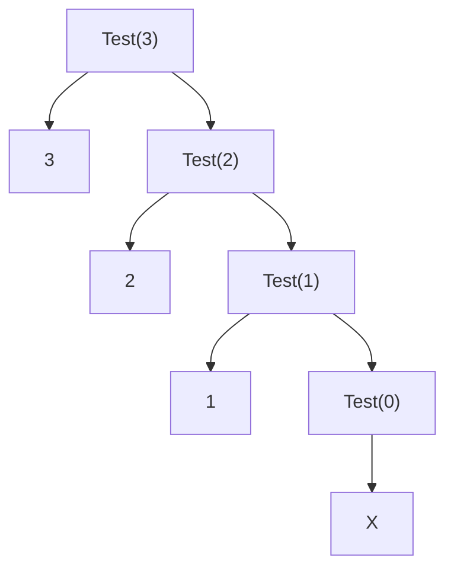

# Recurrence Relation and Asymptotic Analysis

## 2.1.1 Recurrence Relation (T(n) = T(n - 1) + 1) #1

### Example 1

```C
void Test(int n) {

    if (n > 0) {
        printf("%d", n);
        Test(n - 1);
    }
}
```

Putting in `Test(3)` would give us something that looks like this:



In total, calling `printf()` takes 1 unit of time, so it would take **4 units** of time for the whole program to run in this case. This is because we call `Test()` a total of **4** times.

If we were to pass `Test(4)`, it would take **5 units** of time to run. Extrapolating on this, we would find that the program would take **n + 1** operations to run.

In $O()$ notation, this would be $O(n)$ since we would only keep the largest scaling factor.

---

### Example 2

Let's say that $T(n)$ is a function that describes the total amount of time takes by this program:

```C
void Test(int n) {

    if (n > 0) {

        printf("%d", n);  // takes 1 unit of time
        Test(n - 1);      // takes T(n - 1) time
    }
}
```

So, $T(n) = T(n - 1) + 1$.

---

Let's say that $T(n) = T(n - 1) + 1$ for $n > 0$ and $T(n) = 1$ for $n = 0$

$$
T(n-1) = ? \\

T(n) = T(n - 1) + 1 \\
T(n - 1) = T(n - 2) + 1 \\
$$

---

## Asymptotic Notations 101: Big O, Big Omega, & Theta (Asymptotic Analysis Bootcamp)

Algorithms require resources in the form of time or space. We want to find out how much time and space our algorithm takes up. 

>**$T(n)$** - The time or the space a function takes as n changes. We want to bound this function with asymptotes to better understand our algorithm.

>**$O(n)$** - The upper bound of a function.

### Example 1

$T(n)$ is $O(f(n))$ **if**

$T(n) \le c * f(n)$

for all $n \ge n$. 